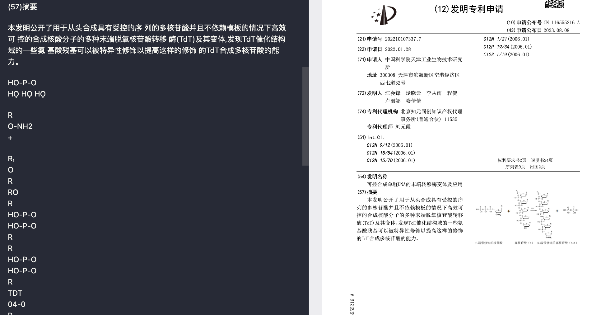

# PDF 提取质量问题分析与行动计划

## 🚨 严重性声明 (Severity Statement)

**一句话总结问题的严重性**: 这是一个核心功能的效果缺陷，它显著降低了关键文档（尤其是包含图表、公式的科技文献）的转换质量，直接影响了本工具的可用性和可靠性。

- **问题定性**: 功能效果缺陷 / 数据提取不完整
- **影响范围**: 影响所有包含非文本元素的 PDF 文档（如化学式、流程图、图表等）的转换结果。
- **紧迫程度**: 🟠 高优先级，需要尽快解决以确保项目产出的数据质量。

### 讨论记录:
> *AI 初步评估：此问题不属于阻塞性故障，但严重影响核心交付物的质量，需要优先投入资源分析和解决。*

---

## 1. 问题描述 (Problem Description)

### 1.1. 现象观察 (Observed Behavior)
- **具体现象 1 (图文混淆)**: `marker` 库在处理 PDF 时，将文档中绘制的矢量图形（如化学反应式）错误地识别为文本块，并尝试进行 OCR 或文本提取，最终在 Markdown 中生成了一堆无意义的字符乱码。如下图所示：
  
- **具体现象 2 (输出单一)**: 当前的 `scripts/02_advanced_marker_processor.py` 脚本在执行后，每个 PDF 文件只生成一个对应的 `.md` 文件。没有提供 JSON 格式的输出，这使得我们丢失了可能由 `marker` 库生成的、更详细的块级（block-level）结构化信息（例如每个文本块的坐标、类型等）。

### 1.2. 预期行为 (Expected Behavior)
- **正确结果 1 (图文分离)**: 脚本应能正确识别文档中的图片/图表区域，将其作为图片保存，并在 Markdown 中通过 `` 的语法进行引用，而不是尝试将其内容转换为文本。
- **正确结果 2 (多格式输出)**: 脚本应提供一个选项（例如通过命令行参数 `--save_json`），允许在生成 `.md` 文件的同时，额外输出一个包含详细结构化信息的 `.json` 文件。

### 讨论记录:
> *在这里记录我们关于问题现象和预期的详细讨论...*

---

## 2. 根因分析 (Root Cause Analysis)

*初步假设，我们将逐一分析和验证*

- **可能原因 A (图文混淆)**: 这很可能是 `marker` 库底层的版面分析模型（Layout Detection Model）的局限性所致。该模型可能对矢量图形和文本的区分能力不足，或者默认配置的识别阈值不适用于此类科技文献。它可能将复杂的线条和符号组合优先判断为“文本”。
- **可能原因 B (输出单一)**: 这是由我们当前的脚本实现决定的。在 `02_advanced_marker_processor.py` 的 `convert_single_pdf` 函数中，我们只调用了 `save_output` 来保存最终渲染的 Markdown 文本，并未编写任何逻辑来捕获和保存 `marker` 转换过程中产生的中间结构化数据。

### 讨论记录:
> *在这里记录我们深入分析、排查并最终确认根本原因的过程...*

---

## 3. 影响评估 (Impact Assessment)

### 3.1. 业务影响
- **后果**:
    1.  **数据质量不可靠**: 对于科研、专利等领域的文档，错误的图文转换将导致关键信息丢失或失真。
    2.  **后期处理成本高**: 需要大量人工来审查和修正错误的 Markdown 输出，违背了自动化的初衷。
    3.  **工具应用受限**: 使得该工具无法可靠地应用于包含大量图表的文档场景。

### 3.2. 技术债务
- **说明**: 当前脚本的功能实现较为初级，没有充分利用 `marker` 可能提供的全部功能（如多格式输出），导致脚本的扩展性和数据价值都打了折扣。

### 讨论记录:
> *在这里记录我们关于问题长短期影响的评估...*

---

## 4. 解决方案探讨 (Solution Brainstorming)

### 方案 A: 深入配置 `marker` (针对图文混淆)
- **思路**: 详细研究 `marker` 库的官方文档和源代码，查找是否存在可以调整版面分析模型行为的参数。例如，可能有控制图片检测灵敏度、文本块合并策略或禁用特定类型内容识别的配置项。
- **优点**: 如果存在相关配置，这将是侵入性最小、实现成本最低的解决方案。
- **缺点**: `marker` 可能没有提供如此细粒度的控制选项。
- **实施复杂度**: 低

### 方案 B: 扩展脚本功能，增加 JSON 输出 (针对输出单一)
- **思路**: 修改 `02_advanced_marker_processor.py` 脚本。首先，研究 `marker` 的 `converter` 对象返回的数据结构。它很可能不是一个单一的 Markdown 字符串，而是一个包含所有块信息的 Python 对象。然后，在 `convert_single_pdf` 函数中，将这个原始对象序列化为 JSON 格式，并根据新的命令行参数 `--save_json` 决定是否将其保存到文件。
- **优点**: 能获取最完整、最原始的结构化数据，为后续更精细的数据处理、分析和纠错提供了可能性。实现逻辑清晰。
- **缺点**: 增加了磁盘 I/O 和存储开销。
- **实施复杂度**: 中

### 方案 C: 引入前置图像预处理器 (针对图文混淆，备选方案)
- **思路**: 在调用 `marker` 之前，使用 `PyMuPDF` 或其他 PDF 处理库，先扫描一遍 PDF，尝试基于规则（例如，大的矢量图形区域）或简单的图像识别模型，将图表区域识别出来并“涂黑”或移除。然后，将处理过的 PDF 交给 `marker` 进行纯文本提取。
- **优点**: 可以在 `marker` 无法配置的情况下，强行分离图文。
- **缺点**: 实施非常复杂，容易破坏文档原有结构，可能引入新的问题，是万不得已时的选择。
- **实施复杂度**: 高

### 讨论记录:
> *在这里记录我们对不同解决方案的权衡利弊过程...*

---

## 5. 最终决策 (Final Decision)

- **选定方案**: **优先实施方案 B，并同步进行方案 A 的调研。**
- **决策理由**:
    1.  **获取数据是前提**: 实施方案 B 可以立即让我们获得更丰富的结构化数据（JSON）。即使图文混淆问题暂时无法解决，我们也可以在 JSON 输出的基础上，通过分析各数据块的特征（如坐标、文本密度等）来进行后处理和纠错，为解决问题提供了数据基础。
    2.  **低成本探索**: 在开发方案 B 的同时，可以对方案 A 进行调研。如果找到了简单的配置方法，就能以最小成本解决图文混淆问题。如果找不到，我们也没有浪费时间，因为方案 B 的成果是独立的、有价值的。
    3.  **方案 C 作为最后手段**: 方案 C 过于复杂且风险高，暂时不考虑，仅作为备选。

### 讨论记录:
> *在这里记录我们确定最终方案的决策过程...*

---

## 6. 实施计划 (Implementation Plan)

### 第一阶段：获取结构化数据 (预计 1-2 天)
- [ ] **任务 1**: 在 `scripts/02_advanced_marker_processor.py` 中添加 `--save_json` 命令行参数。
- [ ] **任务 2**: 调研 `marker` 的核心转换函数（`converter(...)`），确定其详细的返回值结构。
- [ ] **任务 3**: 实现将返回的结构化数据写入到与输入文件同名的 `.json` 文件中的逻辑。
- [ ] **任务 4**: 对一个测试 PDF 运行新脚本，验证 `.json` 和 `.md` 文件是否都能正确生成。

### 第二阶段：改善图文识别 (预计 2-3 天)
- [ ] **任务 5**: 阅读 `marker-pdf` 库的文档，特别是与配置、高级使用和 `ConfigParser` 相关的部分。
- [ ] **任务 6**: 探索 `marker` 源码，寻找任何可能影响版面分析或图片识别的内部参数。
- [ ] **任务 7**: 如果找到相关参数，进行实验，测试不同参数对化学反应式这类图表的识别效果，并寻找最佳配置。
- [ ] **任务 8**: 将最优配置集成到我们的脚本中，可能通过新的命令行参数暴露出来。

### 讨论记录:
> *在这里记录我们制定详细、可执行的步骤和时间表...*

---

## 7. 成功验证标准 (Success Criteria)

### 7.1. 量化指标
- **指标 1**: 运行脚本时，若提供了 `--save_json` 参数，JSON 文件的生成成功率应为 100%。
- **指标 2**: 在测试集（包含化学图表的专利文件）上，错误地将图片解析为文本的比例降低 80% 以上。

### 7.2. 定性指标
- **指标 1**: 生成的 JSON 文件内容翔实，包含了文本块、位置、类型等关键信息，结构清晰。
- **指标 2**: 生成的 Markdown 文件中，化学反应式等图表能以图片形式正确展示，不再出现大量无意义的文本。

### 讨论记录:
> *在这里记录我们明确定义“问题已解决”的标准...*

---

## 8. 行动召唤 (Call to Action)

**总结**: 我们将首先增强脚本，使其能够输出包含丰富信息的 JSON 文件，为后续的分析和修复提供数据基础。同时，我们将深入研究 `marker` 库的配置，寻找直接改善图文识别的方法。
**立即行动**: 我们从 **实施计划的第一阶段** 开始，着手为 `02_advanced_marker_processor.py` 添加 JSON 输出功能。
